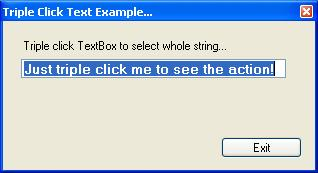



## Set Triple Click Event to any object\.

### Description

Just a simple way to implement a triple click within your code (to any control). Used two API's (+1) without timers, very lightweight. I added an example for selecting whole text when user triple clicked textbox. Comments and votes appreciated! ;-)
 
### More Info
 

             |
---                |---
**Submitted On**   |2005-06-29 10:40:10
**By**             |[Riccardo Cohen](https://github.com/Planet-Source-Code/PSCIndex/blob/master/ByAuthor/riccardo-cohen.md)
**Level**          |Advanced
**User Rating**    |5.0 (40 globes from 8 users)
**Compatibility**  |VB 3\.0, VB 4\.0 \(16\-bit\), VB 5\.0, VB 6\.0
**Category**       |[Coding Standards](https://github.com/Planet-Source-Code/PSCIndex/blob/master/ByCategory/coding-standards__1-43.md)
**World**          |[Visual Basic](https://github.com/Planet-Source-Code/PSCIndex/blob/master/ByWorld/visual-basic.md)
**Archive File**   |[Set\_Triple1906876292005\.zip](https://github.com/Planet-Source-Code/riccardo-cohen-set-triple-click-event-to-any-object__1-61393/archive/master.zip)

